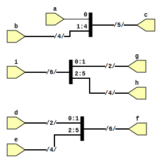

```
 *  Copyright: Sybe Feitsma
 *  This work is licensed under CC BY-SA 4.0 
```

#### Part of Series:
  | 03-select-concate |
  ---------------------
  | => **03A-select-concate** |
  | 03B-select-shift-concate |

## Assignment 03A "Split Concate"

  03A is a tutorial assignment focussed on clarifying selecting from and concatenating with values in verilog. 

#### Your UUT will be checked against a Golden reference. 
  Every clockcyle:

  - UUT Outputs must match REF Outputs
  - If your UUT and the REF diverge the simulation will halt immediatly

  use GTKWave (The software hiding behind the Debug/Spider button) to debug any issues.\
  *This task uses a golden reference. Therefore the trace in GTKwave will always end at the divergence/error point*

# Task
  Implement the provided diagram into verilog.
  | |
  |-|
  | The `[?]` operator **Select**'s a bit from values, with `c = 4'b0101` => `c[0] == 1'b1` and `c[2] == 1'b1`|
  | The `[?:?]` operator **Select**'s parts from values, with `c = 4'b0101` => `c[0:1] == 2'b01` and `c[1:3] == 2'b010`|
  | The `{...}` operator **concatenate**'s values => `c = {2'b01, 1'b1, 1'b0}` makes `c == 4'b0110`|
  | The skeleton UUT (Unit Under Test) file is given with relevant input and outputs. |

  #### Good luck!


>

```
 *  This work is licensed under CC BY-SA 4.0 
```