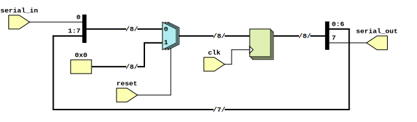

```
 *  Copyright: Sybe Feitsma
 *  This work is licensed under CC BY-SA 4.0 
```

#### Part of Series:
  | 03-split-join |
  ---------------------
  | 03A-split-join |
  | => **03B-split-shift-join** |

## Assignment 03B "Split Shift Join"

  03B utilises the value splitting and joining techniques of 03A to implement a shift register. In these series assignments it will be expected that you have completed the previous assignments in the series. 
  
#### Your UUT will be checked against a Golden reference. 
  Every clockcyle:

  - UUT Outputs must match REF Outputs
  - If your UUT and the REF diverge the simulation will halt immediatly

  use GTKWave (The software hiding behind the Debug/Spider button) to debug any issues.\
  *This task uses a golden reference. Therefore the trace in GTKwave will always end at the divergence/error point*

# Task
  Use the provided module diagram to implement an 8bit shift register with reset.
  | |
  |-|
  | The skeleton UUT (Unit Under Test) file is given with relevant input and outputs. |

  #### Good luck!




```
 *  This work is licensed under CC BY-SA 4.0 
```