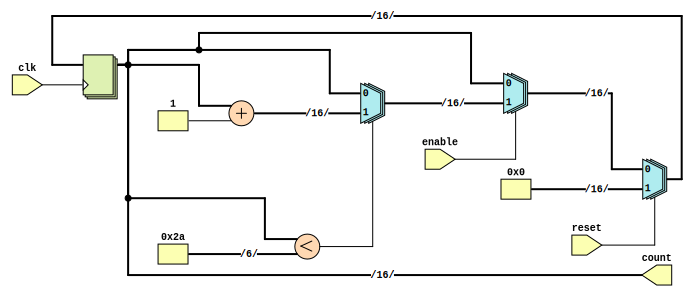

```
 *  Copyright: Sybe Feitsma
 *  This work is licensed under CC BY-SA 4.0 
```

## Assignment 04 "Counter"

  04 requires you to create a counter that counts from 0 to 16. Using the prodivded module diagram.
  
#### Your UUT will be checked against a Golden reference. 
  Every clockcyle:

  - UUT Outputs must match REF Outputs
  - If your UUT and the REF diverge the simulation will halt immediatly

  use GTKWave (The software hiding behind the Debug/Spider button) to debug any issues.\
  *This task uses a golden reference. Therefore the trace in GTKwave will always end at the divergence/error point*

# Task
  Use the provided module diagram to implement a 16bit counter. The counter runs till 16 and rolls-over to 0.
  | |
  |-|
  | **0x2a** and **0x0** are hexadecimal values. Either convert them to decimal or use the hexadecimal notation in verilog.|
  | Hex in verilog:  **width**`'h`**value** => `16'h2a`|
  | The skeleton UUT (Unit Under Test) file is given with relevant input and outputs. |

  #### Good luck!




```
 *  This work is licensed under CC BY-SA 4.0 
```