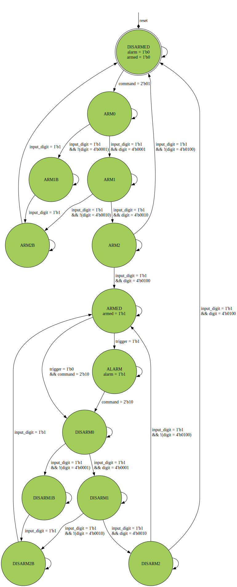

```
 *  Copyright: Sybe Feitsma
 *  This work is licensed under CC BY-NC-SA 4.0 
```
### Assignment 05A "Home Security"

  05A requires you to construct a simple home security system with a 3 digit pincode. implemented as a moore FSM.
  
#### Your UUT will be checked against a golden reference. 
  Every clockcyle:

  - UUT State must match REF state
  - UUT Outputs must match REF Outputs
  - If your UUT and the REF diverge the simulation will halt immediatly

  The skeleton UUT (Unit Under Test) file has been filled in with the relevant input and outputs.
  use GTKWave (The software hiding behind the Debug/Spider button) to debug any issues.

  *This task uses a golden reference. Therefore the trace in GTKwave will always end at the divergence/error point*




```
 *  This work is licensed under CC BY-NC-SA 4.0 
```