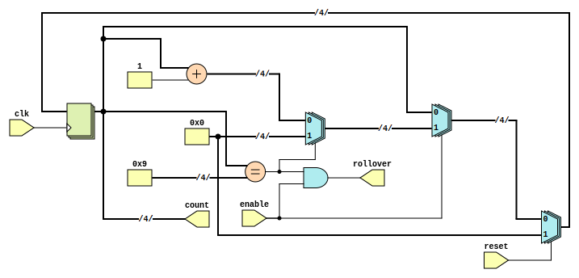

```
 *  Copyright: Sybe Feitsma
 *  This work is licensed under CC BY-SA 4.0 
```
#### Part of Series:
  | 05-Home |
  | --------------------- |
  | 05A-Home-Security |
  | => **05B-Home-Intruding-step-1** |
  | 05C-Home-Intruding-step-2 |

 # TODO YOSYS BMC
### Assignment 05B "Home Intruding" Step 1

  **05C** requires you to construct a tool to crack the security system of **05A**. As you might have noticed, the home security fsm you implemented previously contains a critical security flaw. It does not raise the alarm when incorrect pincodes are repeatedly entered. Exposing the security system to a *brute-force* attack. To build the brute-force system in **05C** we first need to create a subsystem in this assignment.

  
#### Your UUT will be checked against a Golden reference. 
  Every clock cycle:

  - UUT Outputs must match REF Outputs
  - If your UUT and the REF diverge the simulation will halt immediately

  use GTKWave (The software hiding behind the Debug/Spider button) to debug any issues.\
  *This task uses a golden reference. Therefore the trace in GTKwave will always end at the divergence/error point*

  # Task
  Create a 4 bit counter with roll-over signal. Counting from 0 to 9.
  
  | |
  | -- |
  | Count from 0 to 9 if enabled | |
  | signal before rolling over from 9 to 0 | |
  | The skeleton UUT.v file is given with relevant input and outputs. | |

  Good luck!

>

```
 *  This work is licensed under CC BY-SA 4.0 
```
