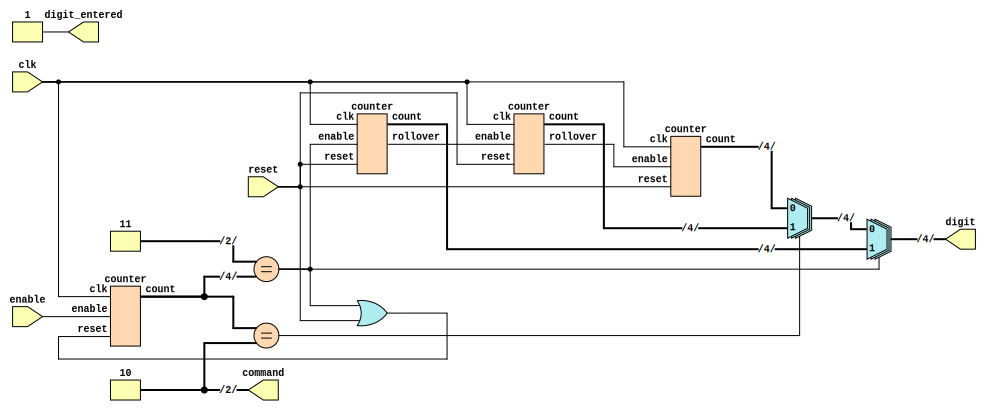

```
 *  Copyright: Sybe Feitsma
 *  This work is licensed under CC BY-SA 4.0 
```

#### Part of Series:
  | 05-Home |
  | --------------------- |
  | 05A-Home-Security |
  | 05B-Home-Intruding-step-1 |
  | => **05C-Home-Intruding-step-2** |

 
### Assignment 05C "Home Intruding" Step 2

  **05C** requires you to construct a tool to crack the security system of **05A**. As you might have noticed, the home security FSM you implemented previously contains a critical security flaw. It does not raise the alarm when incorrect pin codes are repeatedly entered. Exposing the security system to a *brute force* attack.

  
#### Your UUT will be checked against a Golden reference. 
  Every clock cycle:

  - UUT Outputs must match REF Outputs
  - If your UUT and the REF diverge the simulation will halt immediately

  Use GTKWave (The software hiding behind the Debug/Spider button) to debug any issues.\
  *This task uses a golden reference. Therefore the trace in GTKwave will always end at the divergence/error point*

  ## Task
  Combine four instances of the 4-bit counter from the previous step, to brute force the security system pin code. three to generate the pin code and one to cycle between the digits of the pin code.

  | |
  | -- |
  | The counter module is provided. You do not have to create it again |
  | The skeleton UUT.v file is given _without_ inputs or outputs. |

  #### Extra:

  After passing this assignment you will see the found pincode. Extra credit is looking for it manually in GTKWave.

  #### Good luck!

  [The solution to this assignment can be found here, if you find that you need help that is.](https://github.com/OffCourseOrg/verilog/blob/master/assignments/05C-home-intruding-step-2/UUT_ref.v)

>

```
 *  This work is licensed under CC BY-SA 4.0 
```
