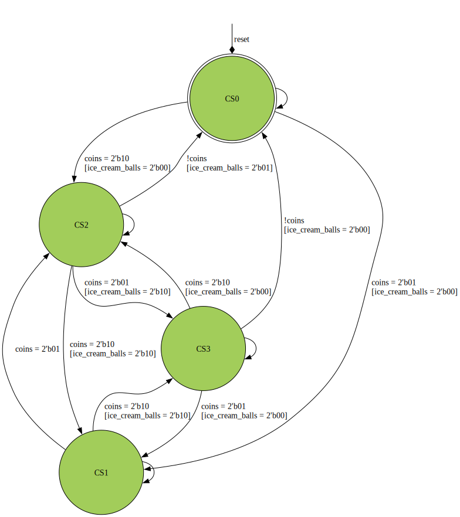

```
 *  Copyright: Aleksandrs Sautkins
 *  This work is licensed under CC BY-SA 4.0 
```

## Assignment 02 "Ice cream Mealy"
  This assignment requires you to make an ice cream Mealy machine, that accepts 1 coin or 2 coins at the time. The machine can output ice cream cone with 1 ball for 2 coins or 2 balls, for 3 coins respectively. Check the diagram carefully to see what is the logic for one and two ball cones.

  
#### Your UUT will be checked against a Golden reference. 
  Every clock cycle:

  - UUT State must match REF state  
  - UUT Outputs must match REF Outputs
  - If your UUT and the REF diverge the simulation will halt immediately

  Use GTKWave (The software hiding behind the Debug/Spider button) to debug any issues.\
  *This task uses a golden reference. Therefore the trace in GTKwave will always end at the divergence/error point*

# Task
  Use the provided state graph to implement the ice cream Mealy FSM. With a 1 bit: clk, reset inputs, 2 bit coin input, 2 bit ice_cream_balls output and state output for which the length you need to figure it out yourself.\

  The states are numbered as such:
  ```
    CS0 = 0
    CS1 = 1
    CS2 = 2
    CS3 = 3
  ```
  | |
  | -- |
  |  **Outputs keep their value unless changed by a state.** | |
  The skeleton UUT (Unit Under Test) file is given _without_ inputs and with state output. Everything else you need to add yourself| |

  Good luck!




```
 *  This work is licensed under CC BY-SA 4.0 
```
