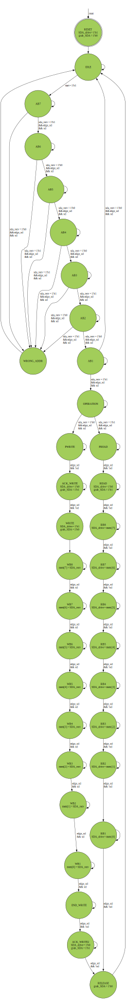

```
 *  Copyright: Sybe Feitsma
 *  This work is licensed under CC BY-SA 4.0 
```
#### Part of Series:
  | 08-iic |
  ---------------------
  | => **08A-iic-decoder** |

## Assignment 08A "IIC Controller"
  *You can ignore the background information if you do not care. However understanding IIC is pretty cool*

  The I<sup>2</sup>C, *Inter-Integrated Circuit*, bus is a popular method to connect microcontrollers to peripherals. Using two wires and a common ground, **SDA** `Serial Data Line` and **SCL**`Serial Clock Line` are used to connected a number of `master` and `slave` devices on a single bus.

  ##### In this series you will be implementing a crude device for the IIC bus. Namely, a `1 byte memory cell`

  **`START`:**
  Communication on the IIC bus starts when the master sends a `START` signal, **SDA** going `low` followed later by **SCL** going `low`, besides the `START` and `STOP` signals, **SDA** never changes whilst **SCL** is `high`

  **Address:**
  Next the master sends a 7 bit address on the **SDA** line. `MSB`,  *Most Significant Bit*, first.

  **R/W Bit:**
  The next bit is either a `low` for a `WRITE` and a `high` for a `READ` operation.

  **`ACK`/`NACK`:**
  If there exists a slave device with the sent address, this slave will send an `ACK` on the **SDA** by pulling it `low`. If the address is invalid and thus **SDA** is `high` this is a `NACK`.

  **With the slave addressed the controller now either reads or writes 8-bits of data from the **SDA** line.**

  **Write operation:**
  The master proceeds similar to the addressing. 8 data bits are written to the slave, `MSB` *Most Significant Bit* first, and the slave responds with an `ACK`. 
  
  **Read operation:**
  The slave now controls **SDA** and it sends 8 data bits, `MSB` *Most Significant Bit* first. The master reponds to this with an `ACK`;
  
  **`STOP`**
  The master then terminates the communication with a `STOP` signal. **SCL** going `high` followed later by **SDA** going `high`

  ```wavedrom
  { signal: [
    {              node: " \u01A2\u01B2\u01A4   \u01B3\u01A6\u01B5  \u01A7   \u01B7  \u01A9\u01B8",
    phase:0.15 },
    { name: "SCL", wave: "1.010|10101010|1010<1.>", phase:0.15 },
    { name: "SDA", wave: "1L1.|0.....1.|0....<H>", phase:-0.4 },
    {              node: ' ABCD GHIJKLMN OPQRST', phase:0.15 }
  ],
    edge: [
      'A+B start', 'C+D BIT7', 'G+H BIT1', 'I+J write',
      'M+N BIT8', 'O+P BIT1',
      'K+L ACK', 'Q+R ACK', 'S+T stop',
      '\u01A2+\u01B2 SGN', '\u01A4+\u01B3 <b>Address</b>', '\u01A6+\u01B5 R/W',
      '\u01A7+\u01B7 <b>Data</b>', '\u01A9+\u01B8 SGN'
  ],
  }
  ```
  This is a very simplified overview of IIC, but sufficient for this assignment. More details can be found in the TI application report.
  [Thanks to Texas Instrument's detailed Application Report. If you want to know more, click here...](https://www.ti.com/lit/an/slva704/slva704.pdf)
  
#### Your UUT will be checked against a Golden reference. 
  Every clockcyle:

  - UUT State must match REF state  
  - UUT Outputs must match REF Outputs
  - If your UUT and the REF diverge the simulation will halt immediatly

  use GTKWave (The software hiding behind the Debug/Spider button) to debug any issues.\
  *This task uses a golden reference. Therefore the trace in GTKwave will always end at the divergence/error point*

# Task
  You will implement a mealy FSM to act as an IIC device. Because **SDA** is bi-directional on the IIC bus and you need to look for edge conditions. We have done some of the work for you outside of the UUT. Mostly this just means that you can create the FSM as described in the state graph below without having to do weird verilog.

  | |
  |-|
  | `SDA_drive` lets you write to the **SDA** line. If you have grabbed the line with `grab_SDA` aka it is set `high` |
  | `SDA_recv` is how you read from the **SDA** line. |
  | The `START` and `STOP` events are dedicated inputs. |
  | Falling and Rising `edges` of **SCL** are signaled on `edge_SCL` |
  | The skeleton UUT (Unit Under Test) file is given with relevant input and outputs. |

  Good luck!


>

```
 *  This work is licensed under CC BY-SA 4.0 
```