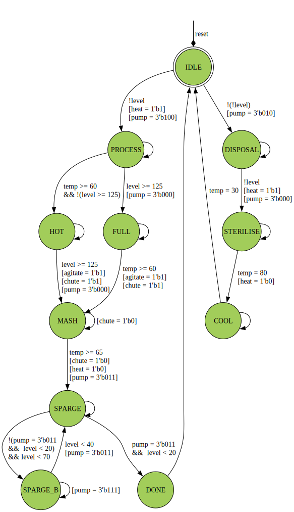

```
 *  Copyright: Sybe Feitsma && e.t.s.v Thor
 *  This work is licensed under CC BY-SA 4.0 
```

## Assignment THOR 01 "Aegir's Brewery FSM" 

  Het Walhalla needs more beer and they have decided to start brewing it themselves. In 01 you will write a FSM to perfectly create the wort needed for the new THOR beer. If you fail, there will be no more beer!
  (A FSM that covered the full brewing process would be actual torture...)
  
#### Your UUT will be checked against a Golden reference. 
  Every clock cycle:

  - UUT Outputs must match REF Outputs
  - If your UUT and the REF diverge the simulation will halt immediately

  use GTKWave (The software hiding behind the Debug/Spider button) to debug any issues.\
  *This task uses a golden reference. Therefore the trace in GTKwave will always end at the divergence/error point*

# Task "brew_fsm.v"
  Use the provided state graph to implement the brew_fsm. With one bit clk and reset inputs.\
  As well as eight bit wide temp and level inputs. The outputs heat, agitate and chute are all one bit wide. The pump output is three bits wide and finally you should output the state of your fsm as an eight bit wide output _state_.

  The reset is active high.

  The states are numbered as such:
  ```
    IDLE = 0,
    DISPOSAL = 1,
    STERILISE = 2,
    COOL = 3,
    PROCESS = 4,
    FULL = 5,
    HOT = 6,
    MASH = 7,
    SPARGE = 8,
    SPARGE_B = 9,
    DONE = 10;
  ```
  | |
  | -- |
  |  **Outputs keep their value unless changed by a state.** | |
  The skeleton brew_fsm.v file is given _without_ inputs or outputs.| |


  ### The solution to this assignment will be posted AFTER the conclusion of the THOR training session.



```
 *  This work is licensed under CC BY-SA 4.0 
```
