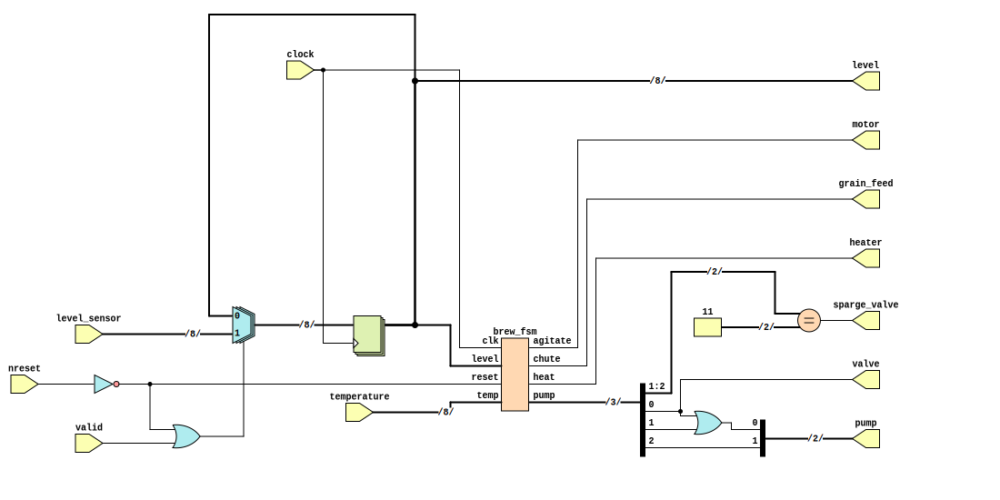

```
 *  Copyright: Sybe Feitsma && e.t.s.v Thor
 *  This work is licensed under CC BY-SA 4.0 
```

## Assignment THOR 01 "Aegir's Brewery"

  Het Walhalla needs more beer and they have decided to start brewing it themselves. The FSM you have created needs to be connected to the brewery's systems. A diagram of the connections and glue-logic has been provided.
  (brew_fsm.v is provided, you can do this assignment without having done the FSM).
  
#### Your UUT will be checked against a Golden reference. 
  Every clock cycle:

  - UUT Outputs must match REF Outputs
  - If your UUT and the REF diverge the simulation will halt immediately

  use GTKWave (The software hiding behind the Debug/Spider button) to debug any issues.\
  *This task uses a golden reference. Therefore the trace in GTKwave will always end at the divergence/error point*

# Task "brew_system.v"
  Integrate the brew_fsm you have created into the rest of the brewery systems.

  | |
  | -- |
  | The modules are provided. You do not have to create them in the brew_system.v file. |
  | The skeleton brew_system.v file is given _without_ inputs or outputs. |

  ### The solution to this assignment will be posted AFTER the conclusion of the THOR training session.

>

```
 *  This work is licensed under CC BY-SA 4.0 
```
