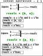
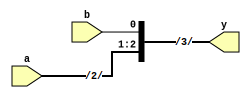

```
 *  Copyright: Sybe Feitsma
 *  This work is licensed under CC BY-SA 4.0 
```

## Background Information:



## TASK: Convert the diagram to verilog.
Building a signal from a set of smaller width signals is done with the `concat` operator.
