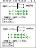
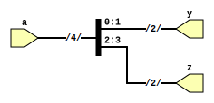

```
 *  Copyright: Sybe Feitsma
 *  This work is licensed under CC BY-SA 4.0 
```

## Background Information:



## TASK: Convert the diagram to verilog.
Extracting a subset of a signal is done using the `select` operator.
