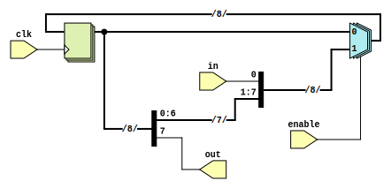

```
 *  Copyright: Sybe Feitsma
 *  This work is licensed under CC BY-SA 4.0 
```

## Convert the diagram to verilog.
Shift registers can also leverage the `select` and `concat` operators. You can always look at questions three and four for the syntax.
